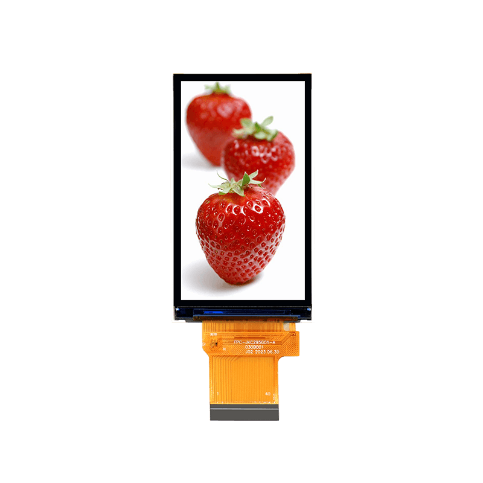

<p align="left"></p>

<h1 align="center">OSPTEK 2.95″ TFT 480×854（ST7701 · MIPI）</h1>

<p align="center"><b>TFT / IPS 模组 · MIPI · ST7701</b></p>

<p align="center"><a href="./README_EN.md">English</a> | 简体中文</p>

<p align="center">
  
  
  
  
</p>

<p align="center"></p>

## 目录

- [产品简介](#产品简介)
- [规格参数](#规格参数)
- [示例工程](#示例工程)
- [仓库结构](#仓库结构)
- [相关资料](#相关资料)
- [购买链接](#购买链接)
- [技术支持](#技术支持)

---

## 产品简介

OSPTEK **2.95 寸 480×854 TFT（IPS）** 是一款 **MIPI** 接口彩色显示模组，显示驱动为 **ST7701**。适合手持终端、竖屏仪表与小型 HMI 等场景。

规格标识（仓库名）：`2.95-tft-480x854-mipi-st7701`

当前模组版本：**YDP295B001-V1**。电气与外形细节以 [`docs/YDP_295_B001_V1_f812644e0f.pdf`](./docs/YDP_295_B001_V1_f812644e0f.pdf) 为准。

## 规格参数

| 项目 | 规格 |
| ---- | ---- |
| 尺寸 | 2.95 英寸 |
| 类型 | TFT / IPS（彩色） |
| 分辨率 | 480×854 |
| 接口 | MIPI |
| 驱动 IC | ST7701 |

> 完整外形尺寸、FPC 定义、供电与时序以产品规格书 / 驱动手册为准。

## 示例工程

| 说明 | 路径 |
| ---- | ---- |
| ESP32-P4 · ST7701 MIPI + esp-lvgl-port / LVGL9 | [`examples/P4-IDF_ST7701-MIPI_ESP-LVGL-PORT_V9/`](./examples/P4-IDF_ST7701-MIPI_ESP-LVGL-PORT_V9/) |
| ESP32-P4 · ST7701 MIPI DSI + LVGL | [`examples/st7701s_mipi_dsi/`](./examples/st7701s_mipi_dsi/) |

## 仓库结构

```text
2.95-tft-480x854-mipi-st7701/
├── README.md
├── README_EN.md
├── MODULE_VERSION.md
├── LICENSE
├── images/          # README 用图
├── docs/            # 规格书、驱动手册、初始化等
└── examples/        # 示例工程
```

## 相关资料

### 本产品资料

| 资料 | 链接 |
| ---- | ---- |
| 产品规格书（YDP295B001-V1） | [`docs/YDP_295_B001_V1_f812644e0f.pdf`](./docs/YDP_295_B001_V1_f812644e0f.pdf) |
| 驱动 IC 数据手册（ST7701S） | [`docs/ST_7701_S_SPEC_V1_3_f82b940377.pdf`](./docs/ST_7701_S_SPEC_V1_3_f82b940377.pdf) |
| 初始化序列（C 源码） | [`docs/ST7701S+BOE2.95-2L.c`](./docs/ST7701S%2BBOE2.95-2L.c) |
| 初始化命令表（`st7701s.h`） | [`docs/st7701s.h`](./docs/st7701s.h) |
| RGB 时序参数 | [`docs/RGB时序参数.png`](./docs/RGB%E6%97%B6%E5%BA%8F%E5%8F%82%E6%95%B0.png) |

### 示例工程

- [ESP32-P4 ST7701 MIPI + LVGL9](./examples/P4-IDF_ST7701-MIPI_ESP-LVGL-PORT_V9/)
- [ESP32-P4 ST7701 MIPI DSI + LVGL](./examples/st7701s_mipi_dsi/)

## 购买链接

<p align="center">
  <a href="https://shop110742373.taobao.com/"></a>
  &nbsp;&nbsp;
  <a href="https://www.aliexpress.com/store/1105701619"></a>
</p>

**国内（淘宝）**

- 店铺：[鱼鹰光电工厂店](https://shop110742373.taobao.com/)

**海外（AliExpress）**

- 店铺：[OSPTEK Official Store](https://www.aliexpress.com/store/1105701619)

## 技术支持

- 技术支持 / 产品咨询：<luyu@osptek.com>
- QQ 技术交流群：**985881096**
- 公司官网：<https://osptek.com/>
- 有任何问题，都可以在本仓库 Issues 中提问

---

<p align="center"><sub>© 2026 OSPTEK 鱼鹰光电 · 本仓库资料采用 CC BY 4.0 许可</sub></p>
